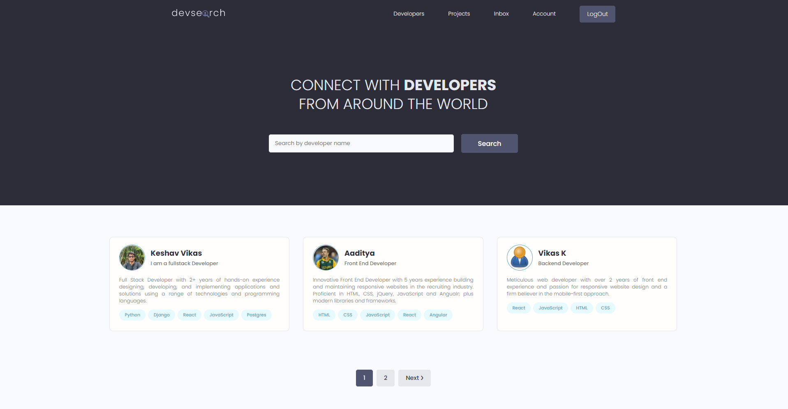

# DevSearchApp
It is a web application where developer can create profile and collaborate with other developer.
# Features
* Browse and search for other developers
* Browse and search for projects
* Sign up and log in into account
* Edit / Delete account information
* Create / Edit / Delete your projects
*  Share Projects
* Comment other's projects
* Rate others work
* Send messages to developers / Read your inbox messages
* Reset password to your account via email

:key: Take a look --> https://devsearchk.herokuapp.com/

# Tech Stack
* Django
* Django REST Framework
* Postgres

# Home Page
  

# Projects Page
  

# Profile Page
    

# User Inbox
   

